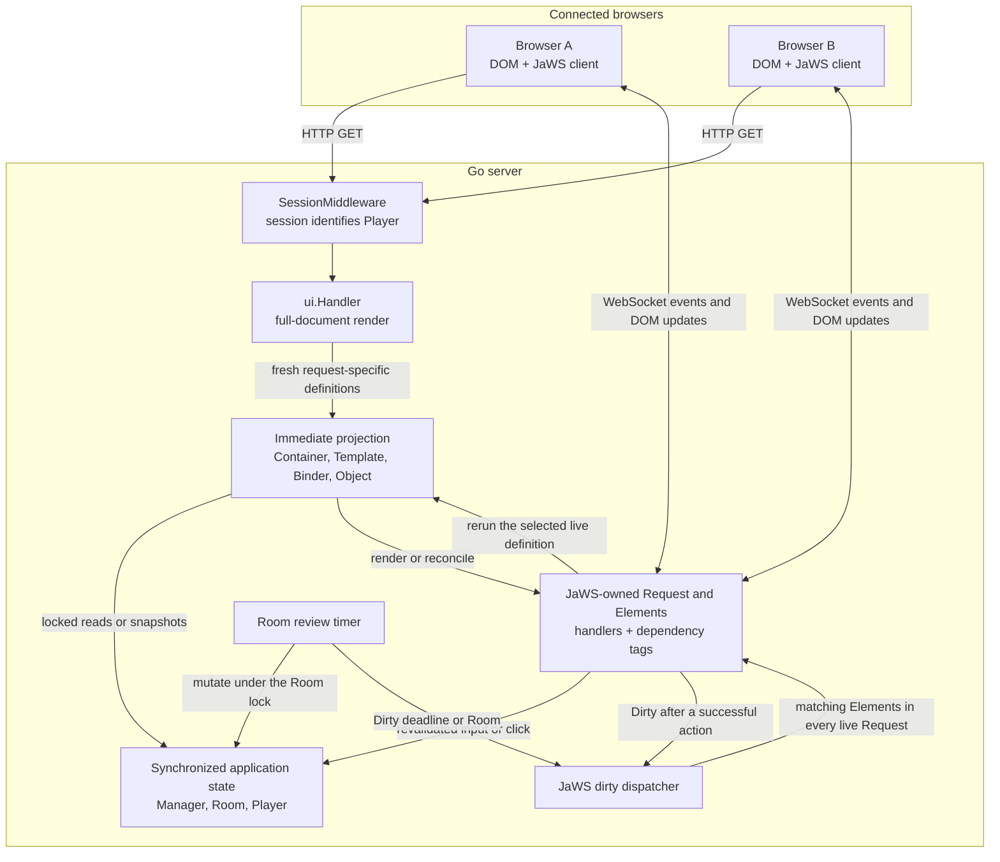

# Pretend You're Xyzzy

Pretend You're Xyzzy is a multiplayer fill-in-the-blank party card game and a
complete example of a server-driven UI built with
[JaWS](https://github.com/linkdata/jaws). Synchronized Go state is the source of
truth, templates project that state, and JaWS carries browser events and
targeted DOM updates over WebSocket.

JaWS is an immediate-mode framework, not an MVC framework. This application
does not have controllers, retained view models, or application-defined
browser state. It also has no custom application JavaScript: Bootstrap and the
JaWS browser transport run in the browser, while the game and its UI behavior
remain in Go.

## Run it

The module requires Go 1.26.1 or later. To start a local two-player game:

```sh
go run ./cmd/xyzzy -debug -address 127.0.0.1:8080
```

Open <http://127.0.0.1:8080/> once in a regular window and once in a private
window, or use two separate browser profiles. A single browser profile shares
one JaWS session and therefore represents one player. Debug mode lowers the
normal minimum player count from three to two and makes short games easier to
exercise.

All templates, styles, and card data are embedded in the binary. There is no
database, Node.js build, or npm dependency. A production binary can be built
with:

```sh
go build -o xyzzy ./cmd/xyzzy
```

Game and session state are in memory, so restarting the process starts fresh.

## Design rationale

### Immediate-mode ownership

Each page request creates a request-specific `ui.Handler` and render dot. The
render code reads the current synchronized state and describes the UI that
should exist now. JaWS owns the live `Request` and `Element` trees, retains the
definitions needed for events and updates, and reruns selected definitions.
When a child list can change, a `Container` reconstructs and reconciles only its
direct children.

The application never stores a JaWS `Request`, `Element`, or UI tree in a
`Manager`, `Room`, or `Player`. Values such as `templateDot`, `roomSection`, and
`ReviewRender` are short-lived projections or definitions, not controllers or
retained view models.

The package boundary follows ownership and lifetime rather than MVC roles.
`internal/ui` integrates HTTP, sessions, and templates; `internal/game/jaws_ui.go`
places synchronized bindings and actions beside the state they operate on.



Initial HTML and live updates come from the same Go definitions and getters;
there is no separately maintained client-side rendering path.

### Choose the smallest JaWS primitive

The templates use each live primitive for one distinct job:

| Need | Primitive | Example in this repository |
| --- | --- | --- |
| Render a full document | `ui.Handler` | `serveLobby` and `serveRoom` |
| Include static structure | native `{{template ...}}` | the head, welcome panel, and nickname modal |
| Rerender a fixed live region | `ui.Template` via `$.Template` or `ui.NewTemplate` | the lobby sidebar and room panels |
| Change direct child identity or presence | `ui.Container` via `$.Container` | `roomSection` selects the sidebar and main room child |
| Edit an addressable scalar | `bind.New` | nickname, privacy, and target score |
| Describe a semantic action | `ui.Object` | create, start, submit, judge, and review actions |
| Display dynamic text | a bound `Span` or `Button` getter | the shared review countdown |

Native template inclusion is enough for static markup. A retained `Template`
owns a stable live wrapper whose inner content JaWS may replace. A `Container`
is used only where the set or identity of direct children can change. In
particular, `roomSection` is a comparable value that constructs fresh
`Template` children; equal child definitions let JaWS retain the existing child
`Element`.

The room game panel follows the same rule at a smaller scale:
`room_game_panel.html` is a thin state dispatcher, and each room state lives in
a native template partial. Those partials organize source code without adding
live elements, update boundaries, or retained render state.

A native partial may still read request-time data without becoming a live
region. The lobby welcome panel takes one active-request snapshot for its online
count; it has no independent update boundary.

This keeps wrapper ownership unambiguous: the template emits the contents of a
JaWS wrapper, not a competing copy of the wrapper itself.

### Definition equality and dependency tags are separate

Immediate-mode reconciliation answers two different questions:

1. Is this newly described child equal to the retained child?
2. Which retained elements depend on a piece of state that changed?

Comparable UI definitions answer the first question. Stable dependency tags
answer the second. A parent becoming dirty does not imply that every equal
retained child will rerender, so live children register the state they actually
read.

| Dependency tag | Typical dependents |
| --- | --- |
| `*game.Manager` | the public room list and unseated room lookup |
| `*game.Player` | room membership and player-specific branches |
| `*game.Room` | shared room summary and game regions |
| field pointers such as `&r.targetScore` | independently bound controls and labels |
| `&r.reviewDeadline` | the judge's countdown button and every other player's countdown span |

Calling `Dirty` with one of these tags fans the update out to matching elements
in every live JaWS request. Dirtying an element itself is request-local. The
same field tag can deliberately connect different widget types, as the target
score connects a range input and badge, and the review deadline connects a
button and text span.

### Keep bindings and actions beside authoritative state

Simple fields use `bind.New(&lock, &field)`. That supplies synchronized storage
and a stable field-pointer dependency tag without another adapter type.
Validation is added with `SetLocked`, which checks the current room state while
the same lock is held and then delegates to the original binder.

Deck selection is the one custom input definition because “is this deck
enabled?” is computed from a set rather than stored in an addressable scalar.
`deckInput` implements `JawsGet`, `JawsSet`, and `JawsGetTag` directly and uses
the room as its dependency tag.

Semantic actions are returned as `ui.Object` values. The object's primary
getter may be a dynamic string getter, so its label, click behavior, dependency
tag, and initial attributes stay together. Templates can therefore say, for
example, “render the room's start button” rather than assemble one action from
separate label, attribute, and callback helpers.

Rendered `hidden` and `disabled` attributes are presentation, not
authorization. Privileged room mutations revalidate the player's permissions
and current room state.

`LobbyControlAttrs` deliberately stays separate from the target-score binder.
The range input needs `disabled`, while the span displaying the same bound value
does not. Binder attribute hooks also run while the binder lock is held, so an
attribute helper that reacquired the room lock could deadlock when a writer is
waiting.

### The countdown is server-driven dynamic text

The review countdown demonstrates why dynamic button text belongs in JaWS:

1. `Room.Review` snapshots the winner's nickname string, viewer role, deadline,
   and outcome while holding the room read lock.
2. The judge receives a dynamic JaWS `Button`; other players receive a dynamic
   JaWS `Span`.
3. Both getters register the same `&r.reviewDeadline` dependency tag.
4. One room timer dirties that tag at displayed-second boundaries, updating
   both widget types in every connected browser.
5. At the deadline, the timer advances the state and dirties the room so the
   containing live region changes.

There is no per-browser timer, custom event protocol, `MutationObserver`, or
application JavaScript. Each getter computes role-appropriate display text from
the authoritative server deadline, and JaWS transports targeted DOM operations.

### Sessions and initial rendering

`SessionMiddleware` wraps the page handlers, so a `Player` exists before
`ui.Handler` performs the initial render. A JaWS session identifies the player;
an independent HttpOnly cookie restores only the nickname after an ephemeral
session expires.

Visiting `GET /room/{code}` is intentionally a join attempt. The handler
completes that attempt before rendering, so the first UI description already
represents the resulting membership or observer state. This means the GET may
mutate state; `robots.txt` discourages crawlers, but link unfurlers do not
necessarily honor it.

Visiting `GET /` likewise leaves the player's current room before rendering the
lobby. Page navigation therefore establishes membership before the initial UI
description instead of deferring it to the WebSocket connection.

### Concurrency without presentation DTOs

State types own their synchronization. Operations validate and mutate under
the relevant locks, then notify JaWS after releasing them. When several values
must agree, render helpers snapshot primitive values together under one lock.
For example, review rendering copies the winner's nickname rather than keeping
a `*Player` and reading it after unlock.

Independent room-summary facts use their existing lock-protected accessors. A
single summary render can therefore observe adjacent valid states, but it is
race-free and a subsequent relevant dirty notification converges the display.
The summary does not need a retained presentation model or a large snapshot DTO
merely to make independent labels transactional.

## Deliberate boundaries

- State is process-local and is not shared across server replicas or persisted
  across restarts.
- A private room is omitted from the public list; possession of its URL is the
  access mechanism, not an authorization boundary.
- A viewer who loads a full room does not automatically take a seat when one
  becomes free; reloading retries the join.
- The first lobby or room visit from an anonymous browser creates an ephemeral
  session and player. Expired seated players are removed from rooms during
  later page requests; an unseated player has the JaWS session's lifetime.
- The lobby's online count is a render-time snapshot of active JaWS requests.
  Multiple tabs count separately, and the number changes on the next page render.
- The broad `*Room` tag on deck checkboxes favors a simple definition over a
  narrower tag type; unchanged inputs suppress redundant value updates.
- JaWS-managed buttons and inputs require the WebSocket connection. The server
  does not replay actions performed while a browser is offline.

## Code map

- [`cmd/xyzzy/main.go`](cmd/xyzzy/main.go) assembles the catalog, JaWS server,
  game manager, and HTTP server.
- [`internal/ui/app.go`](internal/ui/app.go) defines routes, sessions, and
  full-page handlers.
- [`internal/ui/section.go`](internal/ui/section.go) contains the comparable
  `Container` definitions.
- [`internal/ui/template_dot.go`](internal/ui/template_dot.go) contains
  render-time projections and their tags.
- [`internal/game/jaws_ui.go`](internal/game/jaws_ui.go) keeps binders and
  semantic controls beside the state they operate on.
- [`internal/game/room.go`](internal/game/room.go) contains the game state
  machine and review timer.
- [`assets/templates`](assets/templates) defines the HTML shape.
- [`internal/ui/immediate_mode_live_test.go`](internal/ui/immediate_mode_live_test.go)
  exercises multi-browser reconciliation through real JaWS WebSockets.

## Verify it

Run both test modes from the module root:

```sh
go test -race ./...
go test ./...
```

The race-enabled run checks concurrent state and multi-client updates. The
plain run also compiles and exercises JaWS's release tag implementation; JaWS
uses a different, debug-friendly implementation under `-race`.

## License

Pretend You're Xyzzy is distributed under the [MIT License](LICENSE).
